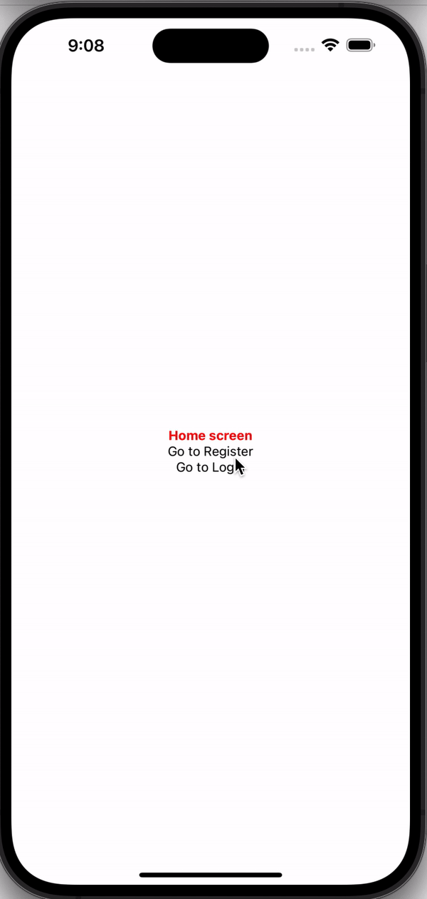
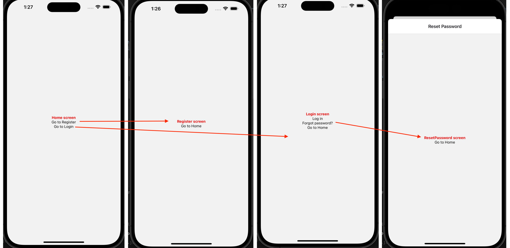
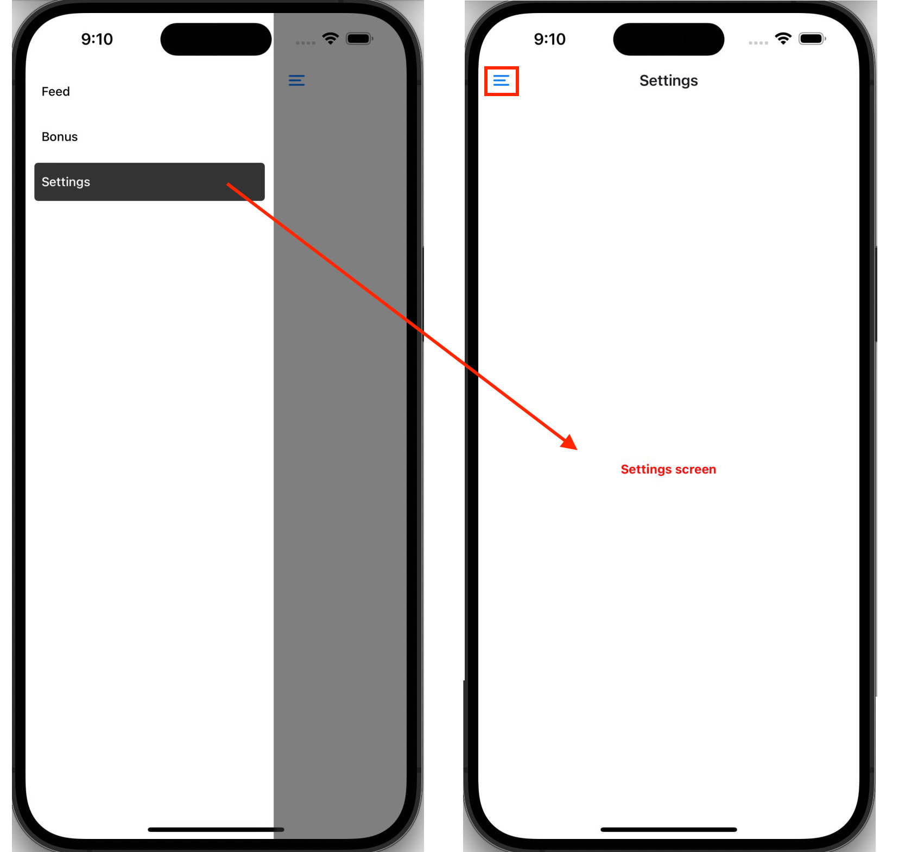
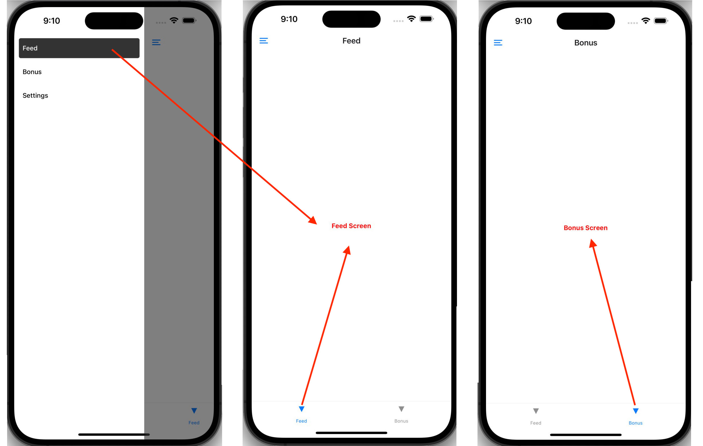

<!--  -->

# This app creates the following navigation:

- Root Level (Stack):
  - 4 Screens (app/index, app/login, app/register, reset-password) with Stack Navigator
  - 1 Screen opens as a Modal (reset-password)
     
     
    
     
     
- 1 Level Deep (Drawer):
  - 1 Drawer Navigator (`app/(drawer)/\_layout.tsx`)
  - 1 screen (`app/(drawer)/settings`)
  - Tabs navigator is not rendered on `settings` screen
     
     
    
     
     
- 2 Levels Deep (Tabs):
  - 1 Tabs Navigator with 3 screens (`app/(drawer)/(tabs)/bonus`, `app/(drawer)/(tabs)/feed`, `app/(drawer)/(tabs)/protected`).
  - The `protected` screen is hidden from the Tab menu items
  - The Drawer icon is visble and can be toggled
     
     
    
     
     
