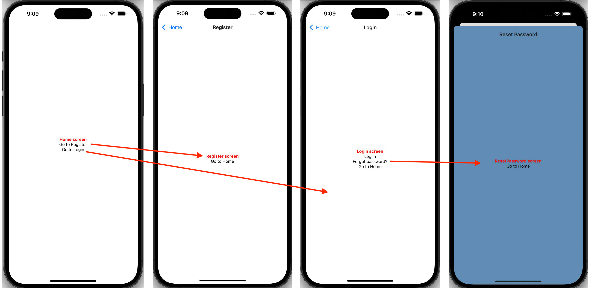

<!--  -->

# This app creates the following navigation:

- Root Level (Stack):
  - 1 Stack Navigator (`app/_layout`) with 4 Screens (`app/index`, `app/login`, `app/register`, `app/reset-password`)
  - 1 Screen opens as a Modal (`reset-password`)
  - When modal is open:
    - The status bar contents on iOS is in white color
    - The status bar contents on Android is in black color
       
       
      
       
       
- 1 Level Deep (Drawer):
  - 1 Drawer Navigator (`app/(drawer)/_layout.tsx`)
  - 1 screen (`app/(drawer)/settings`)
  - Tabs navigator is not rendered on `settings` screen
     
     
    
     
     
- 2 Levels Deep (Tabs):
  - 1 Tabs Navigator (`app/(drawer)/(tabs)/_layout.tsx`) with 3 screens (`app/(drawer)/(tabs)/bonus`, `app/(drawer)/(tabs)/feed`, `app/(drawer)/(tabs)/protected`).
  - The `protected` screen is hidden from the Tab menu items
  - The Drawer icon is visible and Drawer menu can be toggled
     
     
    
     
     
